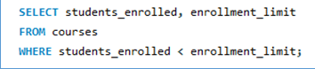

# Finals-Lab-Task-3.1 Using MYSQL CLAUSE step by step

## Task 1: Retrieve all courses where students_enrolled is less than the enrollment_limit

## Task 2: Group courses by category and calculate the total number of students enrolled for each category

## Task 3: Retrieve the courses that are fully enrolled (i.e., students_enrolled equals enrollment limit)

## Task 4: Calculate the total number of students enrolled across all courses

## Task 5: Sort courses by students enrolled in ascending order

- Task 1

 
- Task 1 table structure

- Task 2

- Task 2 table structure

- Task 3

- Task 3 table structure

- Task 4

- Task 4 table structure

- Task 5

- Task 5 table structure

